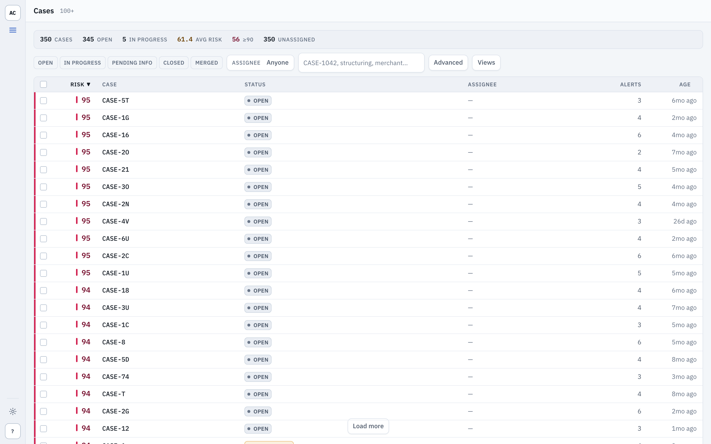
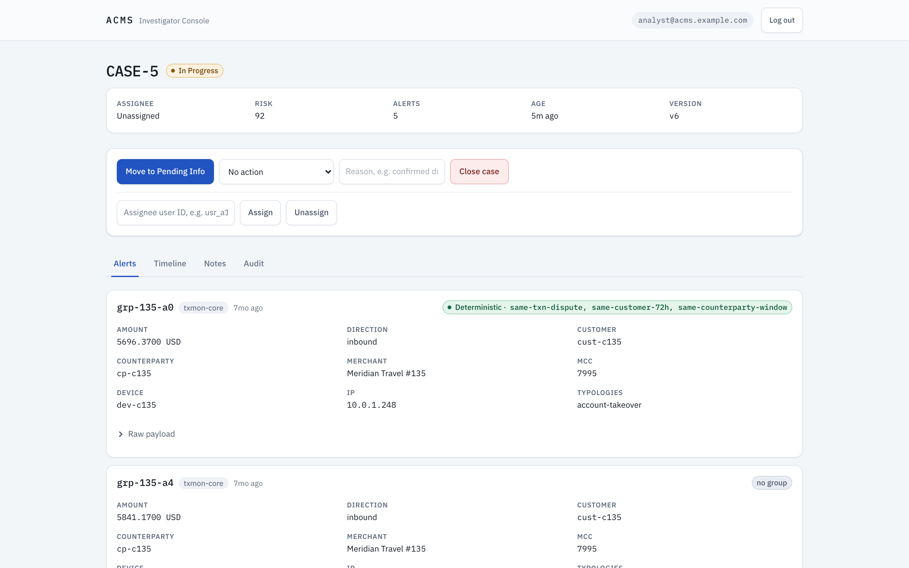
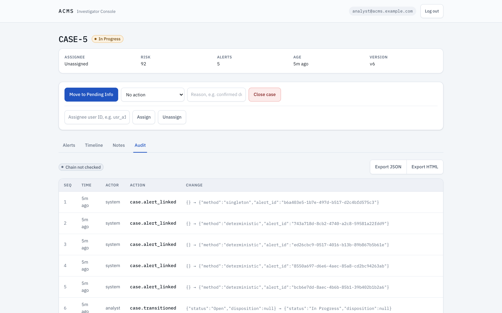
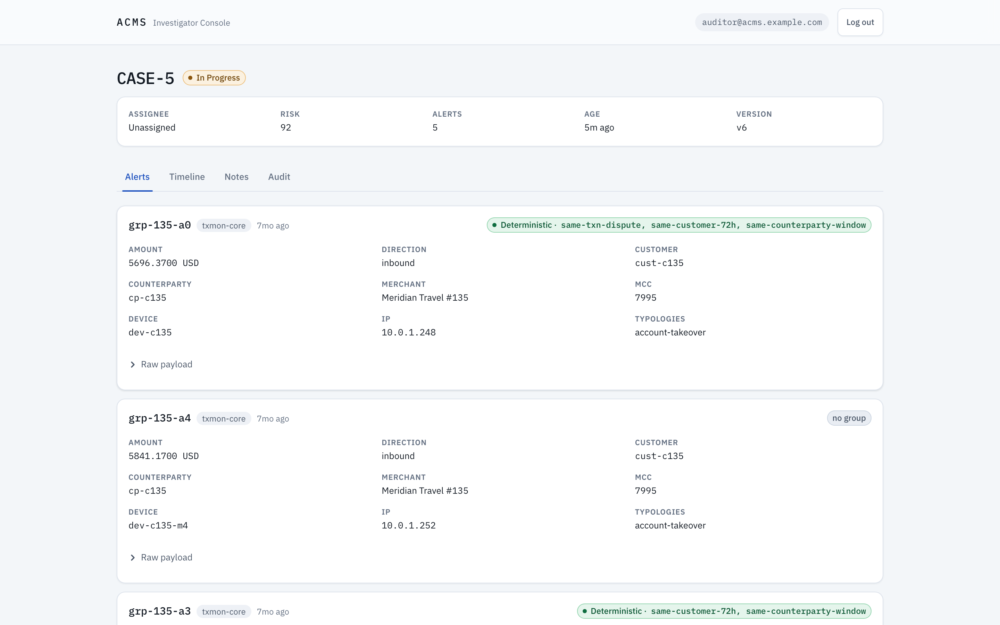

# ACMS — Alert Case Management & Deduplication System

ACMS takes a firehose of fraud and AML alerts, groups the ones that describe the
same underlying activity into a single case, and gives investigators a worklist,
a case view with the grouping rationale spelled out, and a tamper-evident audit
trail they can export for a regulator. It is designed to run on one node.

The full product and architecture spec is in
[`docs/PRD-alert-case-management.md`](docs/PRD-alert-case-management.md). The HTTP
API is documented in [`docs/api/README.md`](docs/api/README.md). Deployment is in
[`DEPLOY.md`](DEPLOY.md).

## Architecture in one line

FastAPI + an in-process grouping engine over PostgreSQL 16, an ARQ worker on
Valkey for bulk grouping, a React/Vite SPA, and a Caddy proxy in front — see
[PRD §11](docs/PRD-alert-case-management.md) for the prescriptive version.

## Screenshots

| Cases dashboard | Case detail — Alerts tab |
|---|---|
|  |  |
| **Audit trail** | **Read-only analyst** |
|  |  |

More, including dark theme, in [`docs/screenshots/`](docs/screenshots/).

## Quickstart

Requires Docker Engine and Compose v2.

```bash
cp .env.example .env
# edit .env: set JWT_SECRET to a random string; leave SITE_ADDRESS=http://localhost for local use
docker compose up --build -d
docker compose run --rm seed        # migrates, then loads demo data
```

Open <http://localhost>. The `seed` command prints an ingest API key on its last
lines if you want to post alerts to `/api/v1/alerts` yourself. It resets the
database first, so run it once on a fresh stack — not on every upgrade.

### Demo logins

The seed data creates three accounts, all with password `demo-pw`:

| Email | Role | Can |
|---|---|---|
| `admin@acms.example.com` | admin | everything, including `POST /api/v1/audit:verify` |
| `analyst@acms.example.com` | analyst | work cases: transition, assign, note, export |
| `auditor@acms.example.com` | readonly | read cases and the audit log; export |

## Development

Backend (Python 3.11, PostgreSQL 16 and Redis/Valkey on localhost):

```bash
cd backend
pip install -e ".[dev]"
python -m pytest -q
ruff check . && black --check . && mypy app scripts
```

Frontend (Node 22):

```bash
cd frontend
npm ci
npm run test -- --run && npm run typecheck && npm run lint && npm run build
```

The end-to-end smoke test in `tests/e2e/test_smoke.py` runs against a live stack;
it is skipped unless `ACMS_E2E=1` (see the file header for the required env).

## Security notes

Known advisories in the current dependency set and why they are accepted for now:

- **`react-router` 6.30.6** (ships in the browser bundle) carries two moderate
  advisories: an open redirect via a backslash in `<Link>` / `useNavigate`
  targets ([GHSA-wrjc-x8rr-h8h6](https://github.com/advisories/GHSA-wrjc-x8rr-h8h6))
  and arbitrary constructor injection through `deserializeErrors()` during SSR
  hydration ([GHSA-337j-9hxr-rhxg](https://github.com/advisories/GHSA-337j-9hxr-rhxg)).
  Impact here is low: every navigation target is a server-issued path, the app
  is a client-only SPA with no data-router SSR, and there is no error
  deserialization path. The remediation is `react-router-dom@7`, a breaking
  major; it is scheduled rather than urgent.
- **`vite` / `vitest` / `esbuild`** advisories (including the high/critical ones
  `npm audit` reports) are all in the local dev server and test runner. They are
  not in the production bundle and nothing in CI exposes a dev server or the
  Vitest UI to the network.

## Licence

This project is released under the MIT Licence — see [`LICENSE`](LICENSE).

Every component on the critical path is permissively licensed — PostgreSQL
(PostgreSQL licence), Valkey (BSD-3-Clause), Caddy (Apache-2.0), FastAPI /
SQLAlchemy / React / Vite (MIT/BSD). Object storage is a Phase 2 feature; the
planned store there is Garage (AGPL-3.0), which would be the first copyleft
dependency and is run unmodified as a separate service. See
[PRD Appendix E](docs/PRD-alert-case-management.md).
